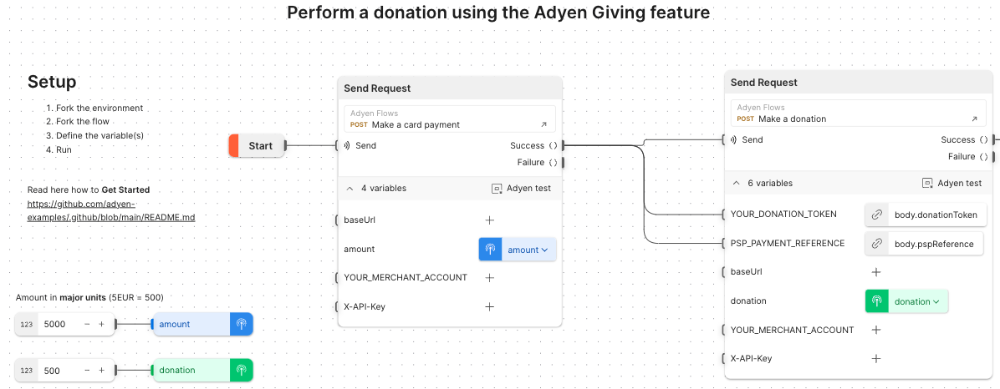
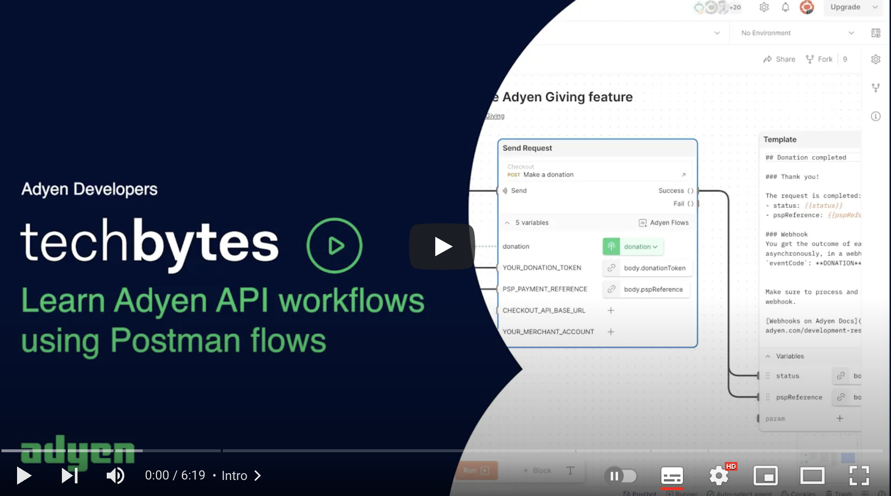

# Getting started with Adyen Postman flows

The Adyen Postman flows provide a visual representation of the workflows you can design with the Adyen APIs. A flow shows how API calls can
be chained and how data can be passed between the various steps.

Why using the Adyen Postman Flows?
* understand API workflows behind the Adyen products and features
* learn how data is passed between the API calls
* run a workflow with your own API Key and configuration settings

## First-time users

Are you accessing the Adyen Postman flows for the first time? Checkout the steps required to setup the environment and everything else you need.

* Fork the desired flow (for example "Giving")
* Fork the relevant Postman environment. For example the "Giving" flow uses `FLOWS Checkout API environment`, fork this Postman environment to create a local (private) copy
* Important: keep the forked environment **private** to protect sensitive information like API key, merchant account, etc..
* Edit the local Postman environment (forked above) to define the settings necessary to perform the API calls
* Edit the local flow (forked above) to use the local Postman environment. This is necessary to run the flow with your own keys and configuration
* Define the variables (for example "amount", "currency", etc..)
* Run the flow

Watch our "Learn Adyen API workflows using Postman flows" video:

## Update local flows 

If you want to edit the local flow (forked above), for example changing the request payloads, you need to fork also the "Adyen Flows" collections.

> **Warning**
Postman forked flows don't support pulling updates. Unlike collections, any modification to the Adyen Flows does not trigger a notification to inform you about the new changes. 
>
