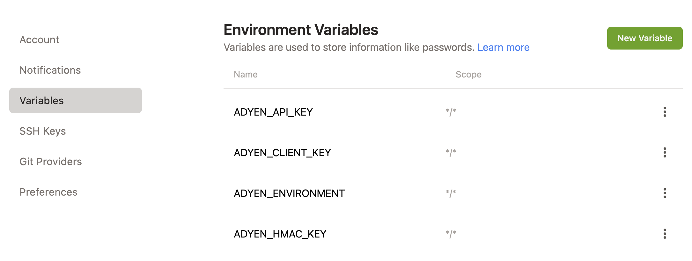

# Getting started with Gitpod

## First time users

Are you running the Adyen sample applications on Gitpod for the first time? Follow the steps below, you only need to do this once.

* Make sure you have an [Adyen Test Account](https://ca-test.adyen.com/ca/ca/overview/default.shtml) and can create the [API key](https://docs.adyen.com/user-management/how-to-get-the-api-key)
* Go to [gitpod environment variables](https://gitpod.io/user/variables)
* Set the `ADYEN_API_KEY`, `ADYEN_CLIENT_KEY`, `ADYEN_HMAC_KEY` and `ADYEN_MERCHANT_ACCOUNT` variables (see below)
* In the [React sample app](https://github.com/adyen-examples/adyen-react-online-payments) the `ADYEN_CLIENT_KEY` should be instead `REACT_ADYEN_CLIENT_KEY`
* Add `https://*.gitpod.io` as allowed origin in the [API Credentials](https://ca-test.adyen.com/ca/ca/config/api_credentials_new.shtml) to make sure the UI can load the Drop-in and Components



## Update environment variables

Do you need to update the API key or another variable? Is your application already running on Gitpod?

* In the Gitpod terminal stop the application
* Set the env variable
```shell
gp env ADYEN_HMAC_KEY=ASDEW##############
```
* Update the environment variables for the terminal session
```shell
eval $(gp env -e)
```
* Restart the application in the terminal (or recreate the Gitpod workpace) 


