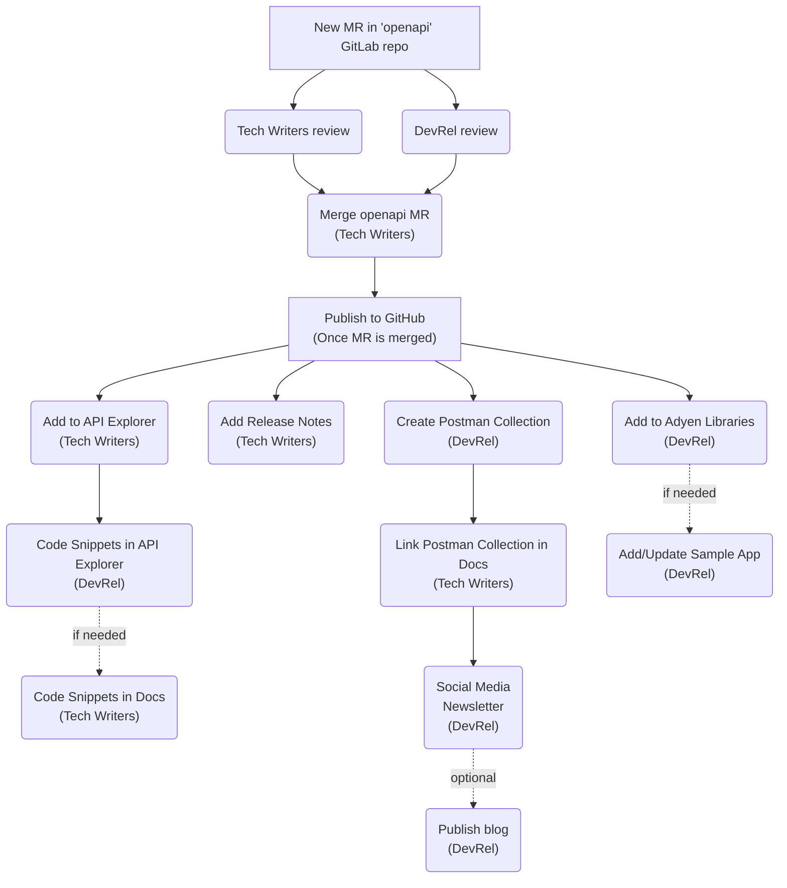

```mermaid
flowchart TB;
  START[New MR in 'openapi' GitLab repo] --> TECH_WRITERS_REVIEW(Tech Writers review)
  START[New MR in 'openapi' GitLab repo] --> DEVREL_REVIEW(DevRel review)

 TECH_WRITERS_REVIEW --> MERGE_OPENAPI_MR
 DEVREL_REVIEW --> MERGE_OPENAPI_MR

 MERGE_OPENAPI_MR("`Merge openapi MR
(Tech Writers)`") --> PUBLISH_TO_GITHUB["`Publish to GitHub
(Once MR is merged)`"]

  PUBLISH_TO_GITHUB --> API_EXPLORER("`Add to API Explorer
(Tech Writers)`")
  PUBLISH_TO_GITHUB --> API_RELEASE_NOTES("`Add Release Notes
(Tech Writers)`")
  PUBLISH_TO_GITHUB --> CREATE_POSTMAN_COLLECTION("`Create Postman Collection
(DevRel)`")

  CREATE_POSTMAN_COLLECTION --> LINK_POSTMAN_COLLECTION("`Link Postman Collection in Docs
(Tech Writers)`")

  PUBLISH_TO_GITHUB --> ADD_ADYEN_LIBRARIES("`Add to Adyen Libraries
(DevRel)`")

  API_EXPLORER --> API_EXPLORER_CODE_SNIPPETS("`Code Snippets in API Explorer
(DevRel)`")
  API_EXPLORER_CODE_SNIPPETS -. if needed .-> DOCS_CODE_SNIPPETS("`Code Snippets in Docs
(Tech Writers)`")

  ADD_ADYEN_LIBRARIES -. if needed .-> SAMPLE_APP("`Add/Update Sample App
(DevRel)`")

  LINK_POSTMAN_COLLECTION --> ANNOUNCEMENT("`Social Media
Newsletter
(DevRel)`")

  ANNOUNCEMENT -. optional .-> BLOG("`Publish blog
(DevRel)`")

```
