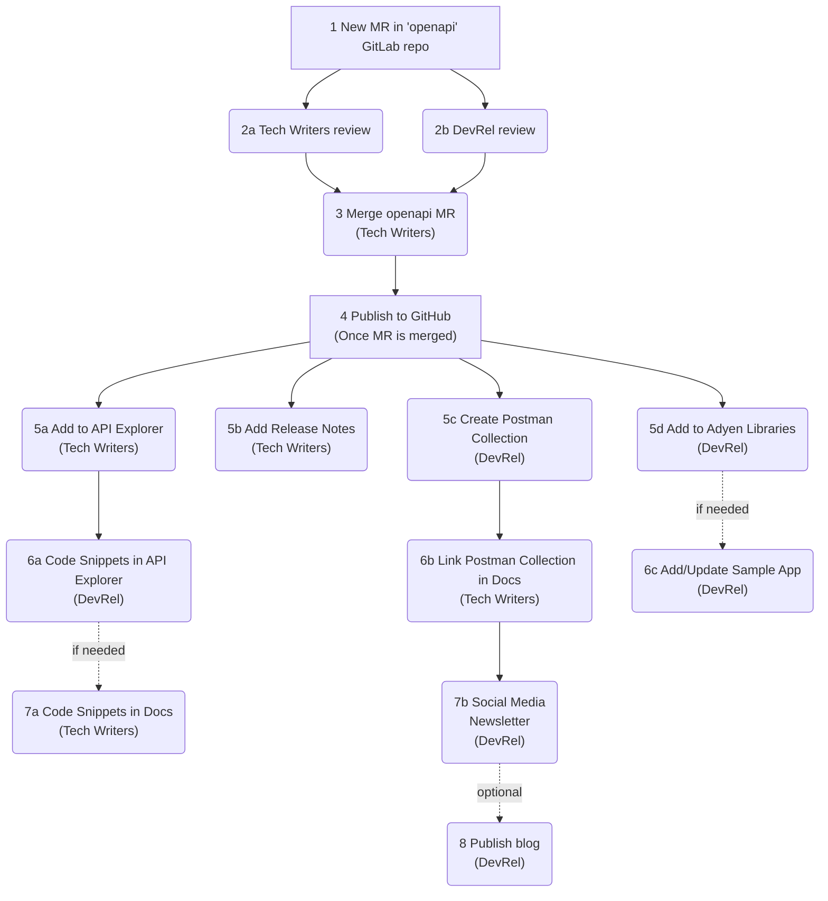

```mermaid
flowchart TB;
  START[1 New MR in 'openapi' GitLab repo] --> TECH_WRITERS_REVIEW(2a Tech Writers review)
  START[1 New MR in 'openapi' GitLab repo] --> DEVREL_REVIEW(2b DevRel review)

 TECH_WRITERS_REVIEW --> MERGE_OPENAPI_MR
 DEVREL_REVIEW --> MERGE_OPENAPI_MR

 MERGE_OPENAPI_MR("`3 Merge openapi MR
(Tech Writers)`") --> PUBLISH_TO_GITHUB["`4 Publish to GitHub
(Once MR is merged)`"]

  PUBLISH_TO_GITHUB --> API_EXPLORER("`5a Add to API Explorer
(Tech Writers)`")
  PUBLISH_TO_GITHUB --> API_RELEASE_NOTES("`5b Add Release Notes
(Tech Writers)`")
  PUBLISH_TO_GITHUB --> CREATE_POSTMAN_COLLECTION("`5c Create Postman Collection
(DevRel)`")
  PUBLISH_TO_GITHUB --> ADD_ADYEN_LIBRARIES("`5d Add to Adyen Libraries
(DevRel)`")


  API_EXPLORER --> API_EXPLORER_CODE_SNIPPETS("`6a Code Snippets in API Explorer
(DevRel)`")
  CREATE_POSTMAN_COLLECTION --> LINK_POSTMAN_COLLECTION("`6b Link Postman Collection in Docs
(Tech Writers)`")

  API_EXPLORER_CODE_SNIPPETS -. if needed .-> DOCS_CODE_SNIPPETS("`7a Code Snippets in Docs
(Tech Writers)`")

  ADD_ADYEN_LIBRARIES -. if needed .-> SAMPLE_APP("`6c Add/Update Sample App
(DevRel)`")

  LINK_POSTMAN_COLLECTION --> ANNOUNCEMENT("`7b Social Media
Newsletter
(DevRel)`")

  ANNOUNCEMENT -. optional .-> BLOG("`8 Publish blog
(DevRel)`")

```
